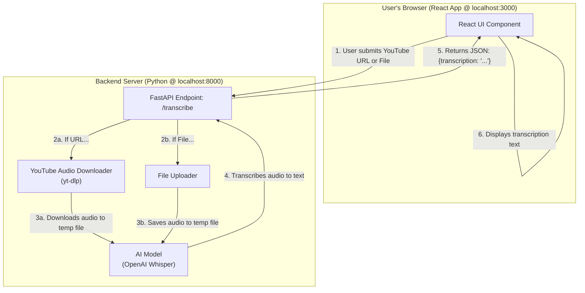

# AI Subtitle Generator

A full-stack web application that automatically generates subtitles from video/audio files or YouTube links using OpenAI's Whisper model.

This project was built to demonstrate proficiency in key technologies required for the **Full Stack AI Engineer** role at **Paytm**, specifically combining Python-based AI development with a modern React frontend.

## Screenshot

 
*(You should replace this with a real screenshot or a GIF of your running application)*

---

## Features

-   **YouTube Link Transcription:** Paste any YouTube URL to get its audio transcribed.
-   **File Upload:** Upload video or audio files directly from your computer.
-   **Responsive UI:** A clean and modern user interface that works on all screen sizes.
-   **Real-time Feedback:** See loading states while the AI is processing the request.

---

## Tech Stack & Architecture

This project is built with a decoupled frontend and backend, communicating via a REST API.

-   **Frontend:**
    -   **React.js:** For building the user interface.
    -   **Axios:** For making HTTP requests to the backend.
    -   **CSS3:** For modern styling and responsiveness.

-   **Backend:**
    -   **Python 3:** As the core programming language.
    -   **FastAPI:** A high-performance web framework for building the API.
    -   **Uvicorn:** An ASGI server to run the FastAPI application.

-   **AI & Data Processing:**
    -   **OpenAI Whisper:** The state-of-the-art speech-to-text model for transcription.
    -   **yt-dlp:** A powerful tool for downloading video and audio from YouTube.
    -   **FFmpeg:** The underlying powerhouse for audio extraction and conversion.

---

## System Architecture & Data Flow

The application follows a standard client-server architecture. The user interacts with the React frontend, which communicates with the Python backend to perform the heavy lifting of audio processing and AI transcription.



---

## Setup and Installation

To run this project locally, you will need `Python 3.8+` and `Node.js v14+` installed.

### 1. Clone the Repository

```bash
git clone https://github.com/your-username/your-repo-name.git
cd your-repo-name
```

### 2. Backend Setup

Navigate to the `backend` directory, create a virtual environment, and install the dependencies.

```bash
cd backend

# Create and activate a virtual environment
python -m venv venv
source venv/bin/activate  # On Windows: .\\venv\\Scripts\\activate

# Install Python packages
pip install -r requirements.txt
```
*(Note: I will create the `requirements.txt` file for you in the next step.)*

### 3. Frontend Setup

In a separate terminal, navigate to the `frontend` directory and install the Node.js dependencies.

```bash
cd frontend
npm install
```

### 4. Running the Application

-   **Start the Backend Server:** From the `backend` directory (with the virtual environment activated):
    ```bash
    uvicorn main:app --reload
    ```
    The API will be available at `http://localhost:8000`.

-   **Start the Frontend Server:** From the `frontend` directory:
    ```bash
    npm start
    ```
    The application will open in your browser at `http://localhost:3000`.

---

## Control Flow

1.  The user either pastes a YouTube URL or selects a file in the React UI.
2.  On clicking "Generate Subtitles", the frontend disables the form and sends a `POST` request to the `/transcribe` endpoint of the FastAPI backend. The request body is `FormData` containing either the URL or the file.
3.  The FastAPI backend receives the request and checks if a URL or a file was provided.
    -   If a URL is present, `yt-dlp` is used to download the audio stream into a temporary file.
    -   If a file is present, it is saved directly to a temporary file.
4.  The path to this temporary audio file is passed to the pre-loaded OpenAI Whisper model.
5.  Whisper processes the audio and returns the transcribed text.
6.  The backend sends a JSON response `{ "transcription": "..." }` back to the React frontend.
7.  The frontend receives the response, updates its state with the new transcription, and displays it in the text area.
8.  A `finally` block on the backend ensures the temporary audio file is deleted to clean up space. 